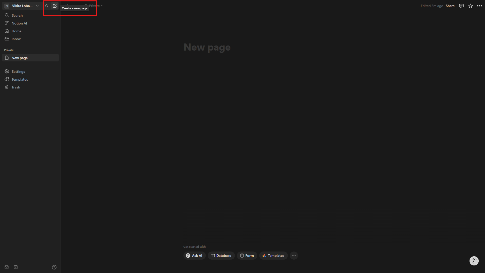
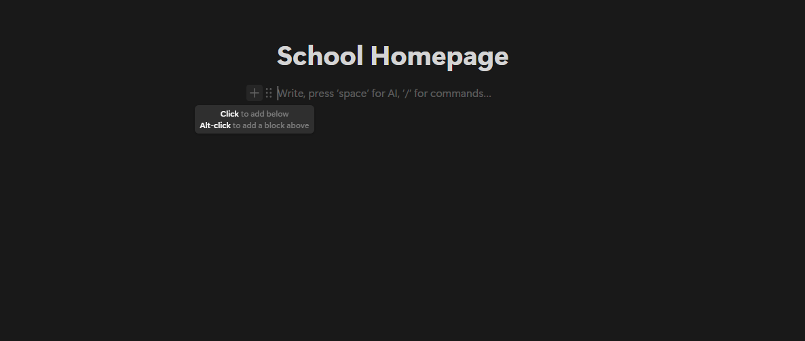
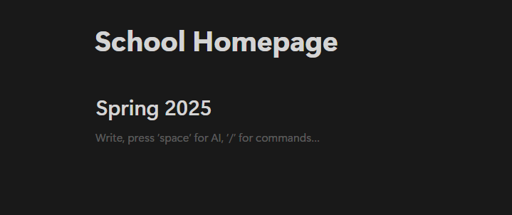
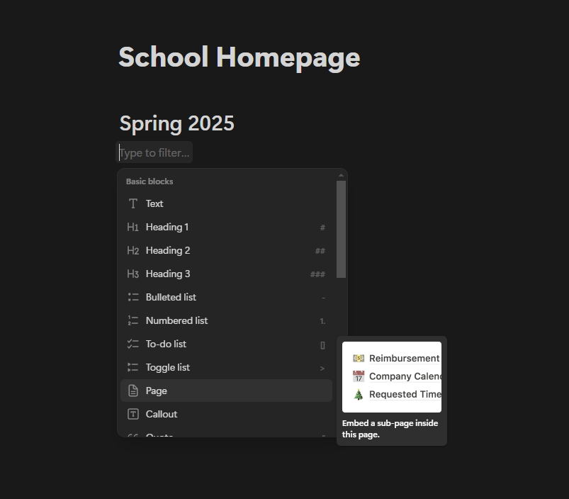
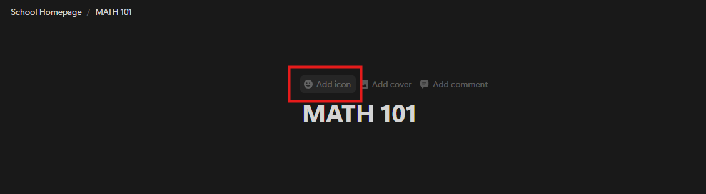
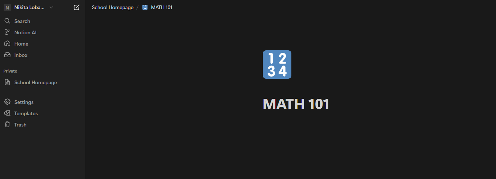
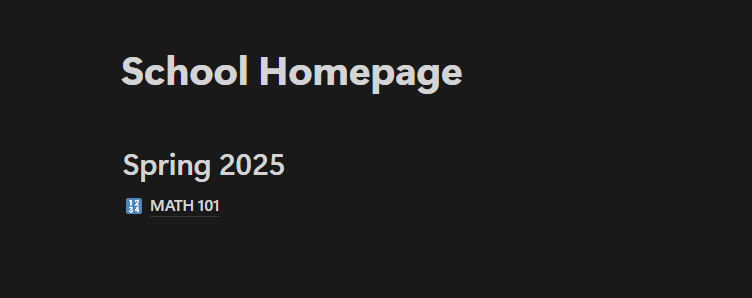

# Setting Up Your School Homepage

Let's create your study home base in Notion! We'll build it together in simple steps.

## Creating Your Main Page

1. Open Notion
2. Look at the top left side of the screen at the top of the sidebar
3. Click the "+" button or the "new page" button
   
4. Type "School Homepage" as your page name

## Adding Your Semester Space

1. Click anywhere on your new page
2. Press the "+" button that appears or enter the '/' character
   
3. Choose "Heading 1" from the menu
4. Type "Spring 2025" (or your current semester)
   
   it should look like this when you're done

## Creating Class Pages

For each class you're taking:

1. Click the "+" button under your semester heading, just like how you created the heading 1 tag
2. Select "Page" from the menu
   
3. Type your class name (Example: "MATH 101")
4. Click "Add icon" to add an emoji to help you better categorize the class
    - Try 📚 for English
    - Or 🔢 for Math
    - Or 🧪 for Science
      
5. Now you've successfully made a subpage in your notion project!
   
   notice how you now have a dedicated page for your math class, and then at the top there is a navigation menu for you to see that it belongs to the school homepage.

    You can also see that on the left sidebar that the MATH 101 page does not appear, this is because it belongs to the School Homepage.

    
    when you go back to the school homepage it should look like this, with the MATH 101 subpage appearing as a link on the page.

You can repeat this for all of your classes, allowing you to have a subpage for everything, keeping all your notes and information nice and organized.
## You're Done! 🎉

Your new homepage has:

-   ✓ A clear main page
-   ✓ Your semester section
-   ✓ Pages for each class

with this you can 

!!! success "Great Job!"
You've built your school hub! Ready to start taking notes?

!!! tip "Helpful Hint"
Feel free to change things around to match how you study best.
