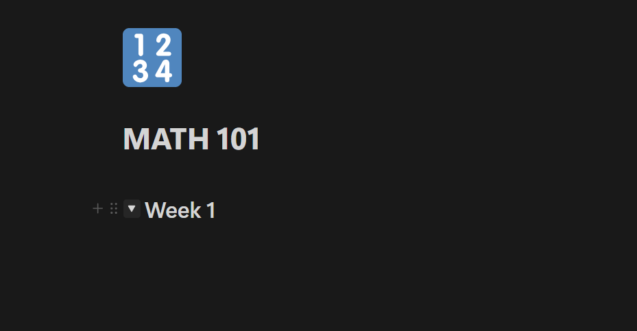
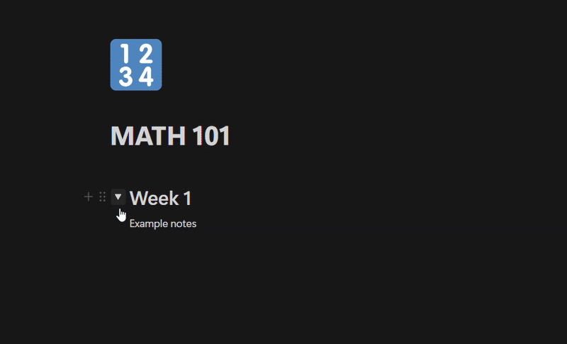
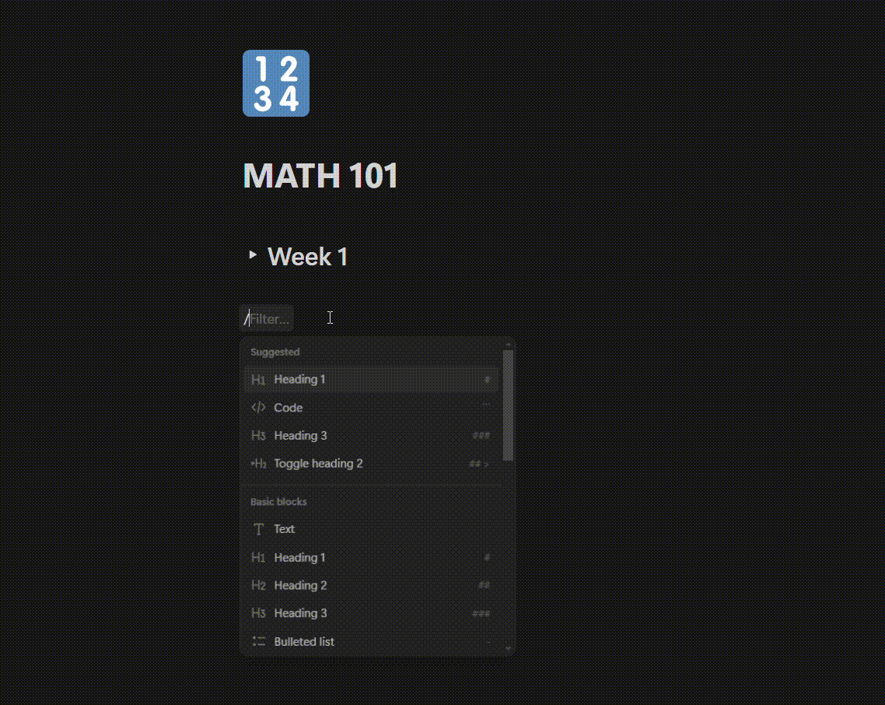
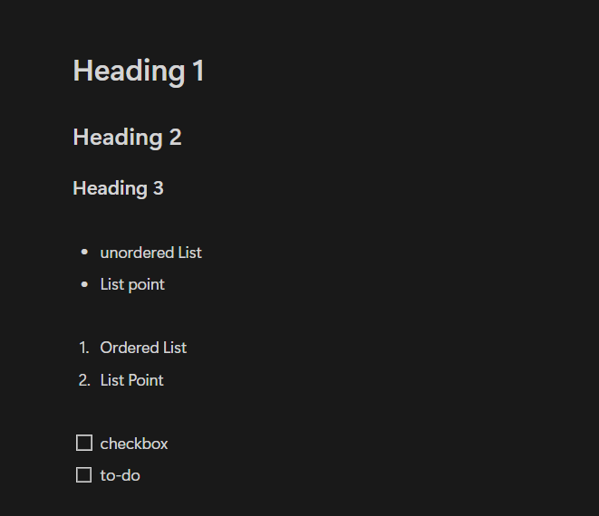

# Building Your Class Notes System

Let's create an easy way to take and organize your class notes in Notion!

## Creating Your First Note

We will start by creating toggle headings, these allow you to hide information until you want to see it.

This can be useful for organizing your notes day by day, allowing you to have all your notes in 1 file while keeping everything organized and easy to find.

1. Open your class page (like MATH 101)
2. Click the "+" button and select "toggle heading 1"
3. Type in "Week 1" or however you want to categorize your notes.

    When you're done it should look like this
    

4. Now when you have that toggle opened, you will be able to see elements under it, and if you don't want to see them anymore you can close the toggle
   

## Adding Pictures and Files to Notes

Sometimes you will want to add images or videos into your notes, here is how you can do that:

1. Click "+" or type the "/" character where you want to add media
2. Choose what you want to add:
    - 📸 Images: Click "Image"
    - 📄 Files: Click "File"
    - 📹 Videos: Copy/paste YouTube links
      

## Making Note-Taking Easier

Notion uses markdown for typing, this means that there are lots of tags you can use to structure your notes, here are the fundamentals:

1. Use '#' for headings, the amount of "#" characters will determine what type of heading.

    '#' = h1

    '##' = h2

    '###' = h3

    Where h1 is the largest heading and h3 is the smallest heading in notion

2. Type '- ' for bullet points or "1. " for a structured list
3. Use '[]' for checkboxes

If you ever forget any of these commands, you can always just enter "/" and see the menu for all the different elements that you can use.

!!! success "Now You Know How To:" 
	- ✓ Create organized notes 
	- ✓ Use toggle lists 
	- ✓ Add pictures and files 
	- ✓ Link your notes together

!!! tip "Remember: Start simple! You can always add more features as you get comfortable."

