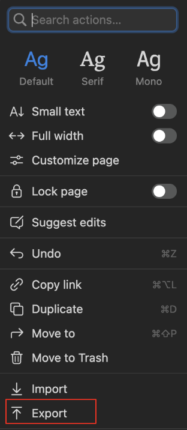
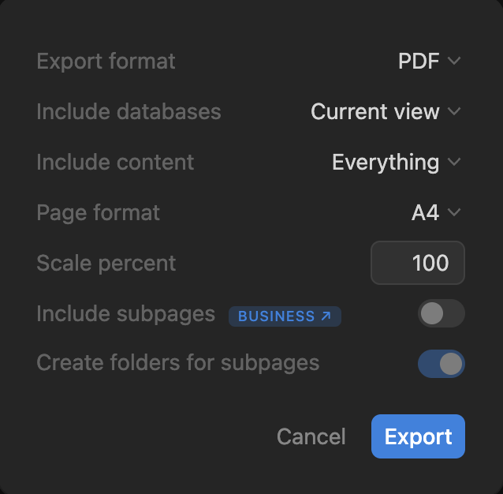

# **Exporting Notion Pages**

Let's see how you can export Notion pages ⤵️

## **Open Page to Export**

1. Open Notion
2. Choose the page you want to export and click on it
3. When on it, look to the top right of the page & click on the three dots ("...")
   

## **Menu opened**
1. In the dropdown menu, click on "Export"

    

2. Once you've clicked, you will be prompted export options
   
3. This will allow you to choose your desired format of export ⬆️
4. Once you've chosen everything click "Export" to finish the process

## **You're Done!** 🎉

!!! success "Great Job! - Now you can Successfully export your work from Notion"

