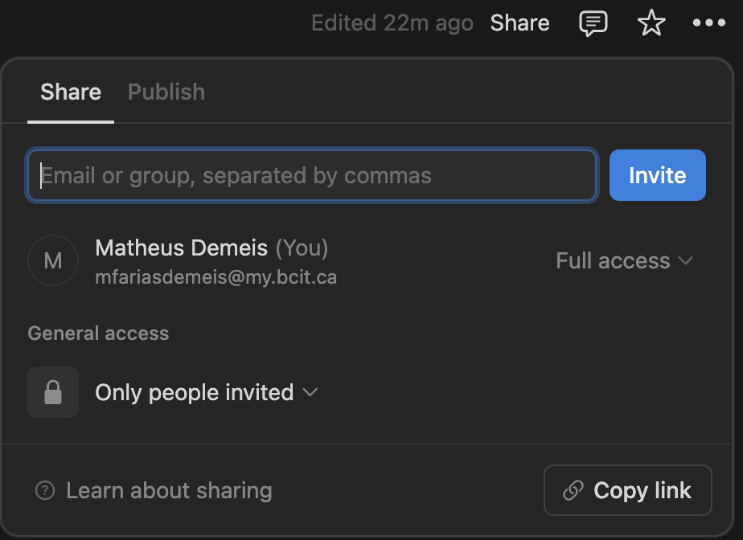
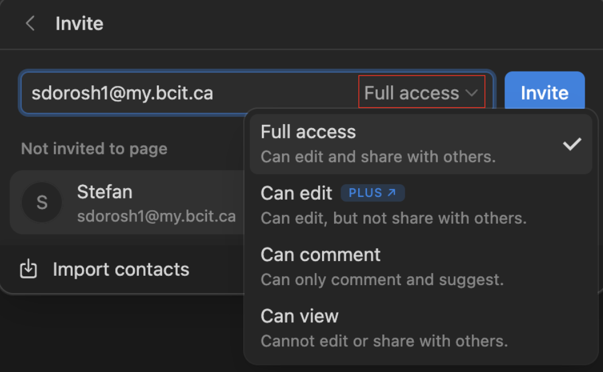
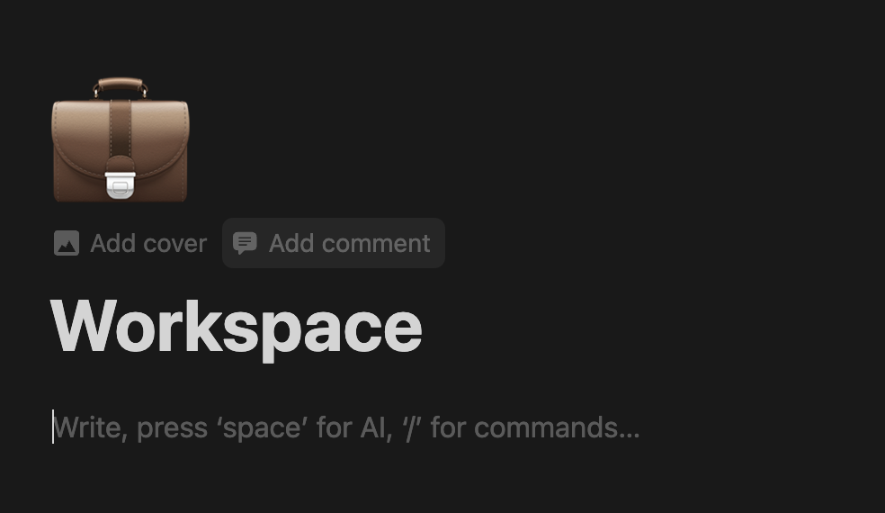
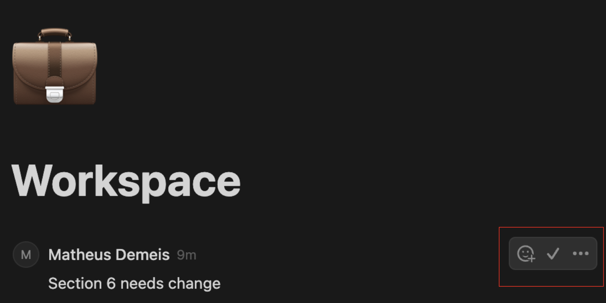

# **Setting Up Collaborative Projects**

Let's now create your Collaborative workspace in Notion! Follow the tutorial below ⤵️

## **Create Workspace**

1. Open Notion
2. Look at the top left side of the screen at the top of the sidebar
3. Click the "+" button or the "new page" button
   
4. Chose your name of preference

## **Invite Collaborators**

1. Look at the top right of the screen 
2. Click the "Share" button
       
3. Enter the email of the person you want to invite
        

## **Set Permissions**

1. Click on "Full Access"
        
2. Choose which permission you want to give to the user & Click on Invite

### **You've invited your Collaborator** 🎉
Lets now see how to work together efficiently on a shared workspace

## **Adding Comments**

1. Hover your mouse near the top right of the page & click on "Add a Comment"
        
2. Here you can add comments about the whole Notion page, this can be used to 
communicate about things you may think are wrong or right!
        
3. These comments are then seen at the top of the page and your team member can
react or resolve them.
        

## **You're Done!** 🎉

Now you can:

-   ✓ Successfully work together with you team
-   ✓ Add comments to their work
-   ✓ Receive feedback from your work
-   ✓ Have a more efficient work environment

!!! success "Great Job!"
    You've built your Collaborative Workspace! Ready to start working with your teams?

    